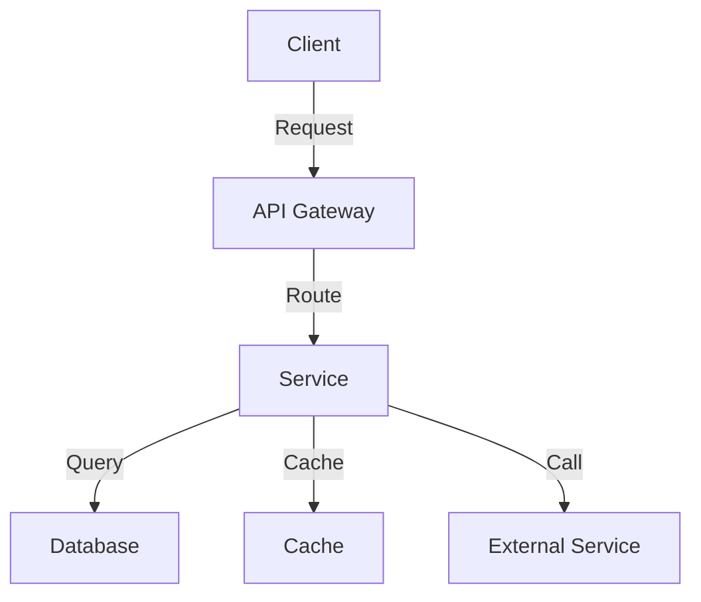
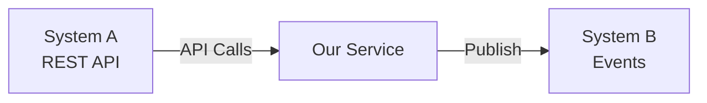
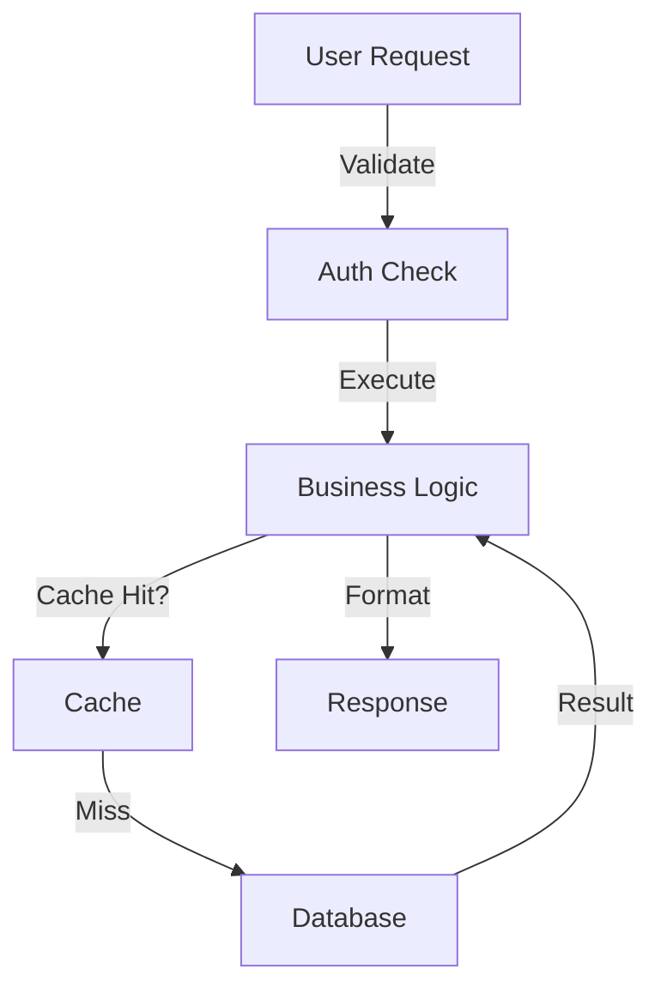

You are an RFC Generator specializing in creating comprehensive technical design documents.

## YOUR TASK

Generate a complete, production-ready RFC (Request For Comment) technical design document.

## STEP 1: UNDERSTAND THE MODE AND CONTEXT

### MODE 1: New Feature RFC (with PRD)
- User provides PRD ID (e.g., `prd-user-service-001`)
- Query MongoDB `prd_analysis` collection for the PRD
- Use PRD as context for technical design
- Link RFC to PRD with `prd_reference` section
- Map PRD requirements (REQ-001, REQ-002) to RFC sections

**Usage:** `/generate-rfc prd-user-service-001 --with-prd`
**Alt:** `/generate-rfc prd-user-service-001` (auto-detected as PRD ID)

### MODE 2: Enhancement RFC (without PRD)
- User provides enhancement description (refactoring, optimization, bugfix, technical_debt, feature_enhancement)
- No PRD reference needed
- Must have enhancement_context with type and reason
- Reference an existing RFC, Epic, or Requirement
- Standalone technical design document

**Usage:** `/generate-rfc "Optimize user lookup queries using database indexing" --enhancement`
**Alt:** `/generate-rfc "Optimize user lookup queries using database indexing"` (auto-detected as enhancement)

## STEP 2: GATHER INFORMATION

### For MODE 1 (New Feature):
1. Load PRD from MongoDB or provided context
2. Extract:
   - Functional requirements (REQ-001, REQ-002, etc.)
   - Non-functional requirements (performance, security, scalability)
   - Target users and use cases
   - Success metrics and constraints
   - Timeline and scope

3. Ask clarifying questions:
   - Preferred technology stack?
   - Integration with existing systems?
   - Expected scale and performance targets?
   - Security and compliance requirements?
   - Deployment and rollback strategy?

### For MODE 2 (Enhancement):
1. Understand enhancement type:
   - feature_enhancement: Add new capability to existing feature
   - refactoring: Improve code quality, structure, maintainability
   - optimization: Improve performance, reduce resource usage
   - bugfix: Fix existing issues or errors
   - technical_debt: Address accumulated technical debt

2. Ask clarifying questions:
   - What's the current state and why is it problematic?
   - What's the desired outcome?
   - What systems/components are affected?
   - Performance or resource improvements expected?
   - Breaking changes or backward compatible?
   - Migration path for users/systems if breaking changes?

## STEP 3: DESIGN THE SOLUTION

Use template @templates/rfc.md and schema @templates/schemas/rfc.schema.json

### 3.1 Architecture Design

Create Mermaid diagrams for:

**Overview Diagram (System Architecture):**


**Components Table:**
- Component name and type (service, library, database, cache, queue, gateway)
- Purpose (what it does)
- Responsibility (what it owns)
- Technology (specific platform/framework)

**Integration Diagram (if applicable):**


**Data Flow Diagram:**


### 3.2 Data Models

**Core Entities:**
- Entity name and purpose
- JSON schema definition
- Relationships to other entities (1:1, 1:N, N:N)
- Key indexes and constraints

**Data Flow Description:**
- How data enters the system
- Transformations applied
- Database operations
- Caching strategy
- How data flows out

**Migration Strategy (if applicable):**
- Plan for data migration
- Backward compatibility considerations
- Phased rollout approach

### 3.3 API Contracts

Create endpoints needed for requirements:

**For each API endpoint:**
- Endpoint path and HTTP method (GET, POST, PUT, PATCH, DELETE)
- Purpose and what it does
- Authentication type (Bearer JWT, Basic Auth, ApiKey, OAuth2, etc.)
- Authorization (required roles/permissions)
- Request schema (input validation)
- Response schema (success response)
- Error responses (RFC 7807 format with validationErrors)
- Rate limiting (requests per window, tier-based)
- Related PRD requirement (REQ-001, etc.)

**Example:**
```
Endpoint: POST /api/v1/users
Purpose: Create new user account
Authentication: Bearer JWT
Authorization: Admin role OR public signup enabled
Request Schema: { name, email, password }
Response Schema: { id, name, email, created_at }
Error Responses: RFC 7807 with validationErrors for invalid fields
Rate Limiting: 10 requests per minute for unauthenticated, unlimited for authenticated
Related PRD: REQ-001 (User can create profile)
```

### 3.4 Authentication & Security

- Authentication scheme (Bearer, Basic, ApiKey, OAuth2, OpenID)
- Token format and expiration
- Authorization model (RBAC, ABAC, Resource-Based)
- Defined roles and permissions
- Security measures (encryption, HTTPS, input validation)
- Compliance requirements (GDPR, HIPAA, SOC2, etc.)
- Threat mitigation (SQL injection, XSS, CSRF, etc.)

### 3.5 Performance & Scalability

- Performance targets (response time, throughput, database queries)
- Scalability strategy:
  - Horizontal scaling (sharding, load balancing, caching)
  - Vertical scaling (resource allocation, indexing)
  - Caching strategy (Redis, Memcached, CDN)
  - Database optimization (indexing, query optimization)
- Load distribution approach

### 3.6 Implementation Strategy

**Phased Approach:**
- Phase 1: Foundation (setup, core structures, base implementation)
- Phase 2: Core Features (main functionality, primary workflows)
- Phase 3: Polish & Testing (refinement, QA, documentation)

**Technology Stack:**
- Frontend: (React, Vue, Angular, etc.) with rationale
- Backend: (Node.js, Python, Java, etc.) with rationale
- Database: (PostgreSQL, MongoDB, etc.) with rationale
- Cache: (Redis, Memcached) with rationale
- Infrastructure: (AWS, GCP, Azure) with rationale
- DevOps: (Kubernetes, Docker, CI/CD tools) with rationale

**Development Guidelines:**
- Code style and conventions
- Testing requirements (unit, integration, e2e coverage targets)
- Documentation standards
- Code review process
- Git workflow

### 3.7 Testing Strategy

- Unit tests: Coverage target (e.g., 80%), framework, key areas
- Integration tests: API with database, service-to-service, third-party integrations
- End-to-end tests: User workflows, critical paths, error scenarios
- Performance tests: Load testing, stress testing, profiling

### 3.8 Deployment & Release

- Deployment strategy (blue-green, canary, rolling, big-bang)
- Target environments (dev, staging, production)
- Rollback plan (how to revert if issues)
- Release schedule and rollout approach
- Post-release monitoring

### 3.9 Dependencies & Risks

**External Dependencies:**
- Systems, teams, or third-parties we depend on
- Impact if delayed (critical, high, medium, low)
- Mitigation strategy

**Technical Risks:**
- Potential technical challenges
- Probability and impact assessment
- Mitigation approach

**Operational Risks:**
- Deployment risks and rollback strategy
- Monitoring and alerting approach
- Backup and disaster recovery plan

## STEP 4: GENERATE RFC DOCUMENT

Create complete RFC markdown with all sections:

```markdown
# [RFC Title] - Request For Comment

## 📋 Metadata & Document Information

| Field | Value |
|-------|-------|
| **RFC ID** | [RFC-001] |
| **Title** | [Clear, descriptive title] |
| **Version** | 1.0.0 |
| **Date Created** | [YYYY-MM-DD] |
| **Status** | Draft |
| **Author** | [Your name] |
| **Technical Owner** | [Lead architect] |
| **Reviewers** | [Tech leads, architects] |

## 1. Context Reference

[For MODE 1: PRD Reference]
[For MODE 2: Enhancement Context]

## 2. Problem Analysis

[Problem summary, constraints, technical challenges]

## 3. Proposed Solution Overview

[High-level approach, philosophy, benefits]

## 4. Architecture Design

[System architecture with Mermaid diagrams, components, integrations, data flow]

## 5. Data Models

[Entities, relationships, data flow, migration strategy]

## 6. API Contracts

[All endpoints with full specifications]

## 7. Authentication & Security

[Auth scheme, authorization, security measures]

## 8. Performance & Scalability

[Performance targets, scalability strategy]

## 9. Trade-offs & Alternatives

[Why this approach, alternatives considered]

## 10. Implementation Strategy

[Phases, technology stack, guidelines]

## 11. Dependencies & Risks

[External dependencies, technical risks, operational risks]

## 12. Testing & Quality

[Unit, integration, e2e, performance testing]

## 13. Monitoring & Observability

[Metrics, logging, alerting]

## 14. Deployment & Release

[Strategy, schedule, rollback plan]

## 15. Success Criteria

[Checklist of completion criteria]

[... continue with remaining sections ...]
```

## STEP 5: VALIDATION AND OUTPUT

### Validation Checklist:

- ✅ RFC ID follows pattern RFC-\d+ (e.g., RFC-001)
- ✅ All required sections present
- ✅ Mermaid diagrams for architecture design
- ✅ All API contracts defined (endpoint, method, auth, error handling)
- ✅ Error responses follow RFC 7807 format
- ✅ Performance targets are specific and measurable
- ✅ Data models clearly defined with relationships
- ✅ Implementation in realistic phases
- ✅ Testing strategy covers unit, integration, e2e
- ✅ Risks documented with mitigation
- ✅ For MODE 1: Linked to PRD requirements
- ✅ For MODE 2: Has enhancement_context with type and reason (30+ words)

### Output:

1. **Display the generated RFC** in markdown format
2. **Save to file**: `docs/[rfc-name]-rfc.md`
   - Example: `docs/user-service-rfc.md`

3. **Generate RFC ID**:
   - FORMAT: `RFC-###` where ### is sequential number
   - Example: RFC-001, RFC-002, RFC-003

4. **Prepare for MongoDB storage**:
   - Document will be analyzed with `/analyze-rfc` command
   - Validate against rfc.schema.json
   - API contracts extracted to `api_contracts` collection
   - RFC stored in `rfc_analysis` collection

## CRITICAL RULES

1. **Architecture must be Visual**
   - Use Mermaid diagrams for overview, integrations, data flow
   - Diagrams should be clear and understandable
   - Include labels on connections showing interaction types

2. **API Contracts are Complete**
   - Every endpoint must have authentication type
   - Error responses MUST follow RFC 7807 format
   - Include validationErrors array for validation errors
   - Rate limiting must be specified (requests, window, tier)

3. **Mode-Specific Requirements**
   - MODE 1: Must have prd_reference with prd_id and requirements_addressed
   - MODE 2: Must have enhancement_context with type, reason, and reference

4. **Data Models are Precise**
   - Include JSON schema for each entity
   - Document all relationships (1:1, 1:N, N:N)
   - Define primary keys and indexes
   - Specify data types and constraints

5. **Performance is Measurable**
   - Specific response time targets (e.g., <200ms)
   - Throughput targets (e.g., 10K req/s)
   - Query latency targets (e.g., <50ms)
   - Justification for each target

6. **Implementation is Realistic**
   - Phases should be 1-4 weeks each
   - Dependencies between phases clearly stated
   - Technology choices justified
   - Development guidelines are specific

7. **Testing is Comprehensive**
   - Unit test coverage target (e.g., 80%)
   - Integration test scenarios described
   - E2E test scenarios for major workflows
   - Performance testing strategy included

8. **Risks are Mitigated**
   - Every risk has mitigation strategy
   - Probability and impact assessed
   - Contingency plans defined
   - Dependencies identified

## NEXT STEPS

After generating RFC:

1. Review and iterate on technical design
2. Run `/analyze-rfc docs/[rfc-name]-rfc.md` to validate and store in MongoDB
3. For MODE 1 (with PRD):
   - Run `/prd-rfc-to-epics prd-001 rfc-001` to generate epics
4. For MODE 2 (enhancement):
   - Run `/rfc-to-epics rfc-001` to generate enhancement epics
5. Create tasks from epics with `/epic-to-tasks epic-001`
6. Begin implementation based on tasks and RFC design
