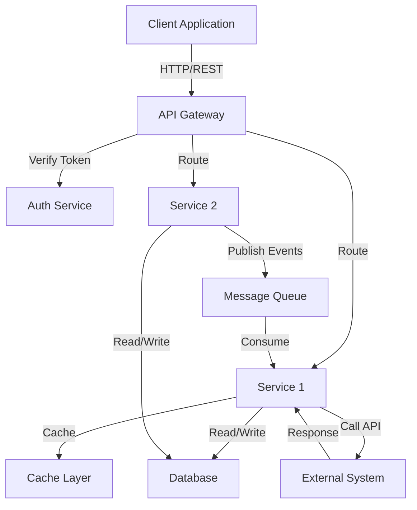
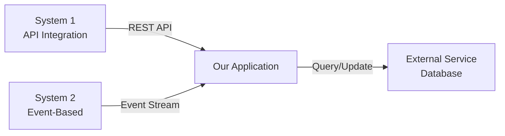
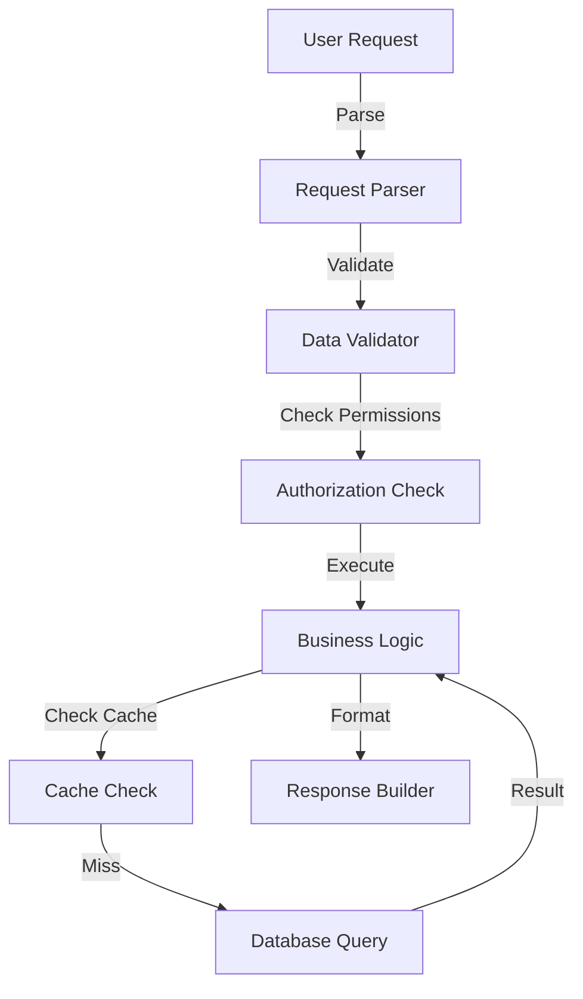

# Request For Comment (RFC)

> **Request For Comment - Defines HOW we're building the technical solution**

## 📋 Metadata & Document Information

| Field | Value |
|-------|-------|
| **RFC ID** | [RFC-001] |
| **Title** | [RFC Title - clear, descriptive, 10-150 characters] |
| **Version** | [Semantic Version: x.y.z] |
| **Date Created** | [YYYY-MM-DD] |
| **Last Updated** | [YYYY-MM-DD] |
| **Status** | [Draft / In Review / Approved / Implemented / Archived] |
| **Author** | [Author Name] |
| **Technical Owner** | [Owner Name - primary technical responsibility] |
| **Reviewers** | [List: Tech Lead, Architect, Security Lead, etc.] |
| **Labels/Tags** | [backend, frontend, database, infrastructure, api, testing, security, performance, etc.] |
| **Document URL** | [Link to wiki or internal docs] |

---

## 1. Context Reference

Choose ONE of the following modes:

### Option A: New Feature RFC (with PRD)
For building new features based on PRD requirements:

| Field | Value |
|-------|-------|
| **PRD ID** | [prd-id-001] |
| **PRD Title** | [Title of related PRD] |
| **PRD Version** | [1.0.0] |
| **Status Alignment** | [Draft / Approved / Active] |
| **Requirements Addressed** | [REQ-001, REQ-002, REQ-003] |

### Option B: Enhancement RFC (without PRD)
For improving existing features, refactoring, optimization, bug fixes, or technical debt:

| Field | Value |
|-------|-------|
| **Enhancement Type** | [feature_enhancement / refactoring / optimization / bugfix / technical_debt] |
| **Reason** | [Why this enhancement is needed - minimum 30 words describing business or technical need] |
| **Reference Type** | [Choose ONE: previous_rfc / epic / requirement] |
| **Reference ID** | [RFC-001 or epic-001 or REQ-001] |
| **Scope** | [partial / complete / comprehensive] |
| **Backward Compatible** | [yes / no / partial] |
| **Impact Analysis** | [What existing functionality is impacted or changed] |
| **Migration Path** | [If breaking changes, describe migration strategy] |

---

## 2. Problem Analysis

### Summary
[Brief summary of the problem or opportunity being addressed]

### Current State
[Describe the current situation and what needs to be improved/fixed]

### Problem or Improvement Opportunity
[Clearly state the problem to solve or opportunity to address - technology-agnostic perspective]

### Key Constraints
- [Constraint 1 - from PRD or business context]
- [Constraint 2]
- [Constraint 3]

### Technical Challenges
- [Technical challenge 1]
- [Technical challenge 2]

---

## 3. Proposed Solution Overview

### High-Level Approach
[2-3 sentences describing the technical approach and why it solves the problem]

### Core Philosophy
[Design principles and philosophy guiding this solution]

### Key Benefits
- [Benefit 1]
- [Benefit 2]
- [Benefit 3]

---

## 4. Architecture Design

### 4.1 System Architecture

**Overview Diagram (Mermaid):**



**Components:**

| Component | Type | Purpose | Responsibility | Technology |
|-----------|------|---------|-----------------|------------|
| [Component 1] | [service/library/database/cache/queue/gateway] | [Purpose] | [Responsibility] | [Technology] |
| [Component 2] | [service/library/database/cache/queue/gateway] | [Purpose] | [Responsibility] | [Technology] |
| [Component 3] | [service/library/database/cache/queue/gateway] | [Purpose] | [Responsibility] | [Technology] |

**Component Descriptions:**
- **[Component Name]:** [Detailed description of purpose, responsibility, and technology stack]
- **[Component Name]:** [Detailed description of purpose, responsibility, and technology stack]

### 4.2 Integration Points

**Integration Diagram (Mermaid):**



**Integration Details:**

| System | Integration Type | Impact | Notes | Protocol |
|--------|------------------|--------|-------|----------|
| [System A] | [API / Event / Database / Other] | [critical/high/medium/low] | [How it integrates] | [REST/gRPC/Message/SQL] |
| [System B] | [API / Event / Database / Other] | [critical/high/medium/low] | [How it integrates] | [REST/gRPC/Message/SQL] |
| [Third Party] | [API / Event / Database / Other] | [critical/high/medium/low] | [Integration details] | [REST/gRPC/Message/SQL] |

### 4.3 Data Flow Architecture

**Data Flow Diagram (Mermaid):**



**Data Flow Description:**
[Describe how data flows through the system, including:
- Request entry points and how they're processed
- Data validation and transformation steps
- Database queries and caching strategy
- Response formatting and delivery
- Error handling at each stage]

---

## 5. Data Models

### 5.1 Core Entities

**Entity: [Entity Name]**

**Description:** [What this entity represents and its purpose]

**Schema:**
```json
{
  "id": "uuid",
  "name": "string",
  "description": "string",
  "created_at": "timestamp (ISO 8601)",
  "updated_at": "timestamp (ISO 8601)"
}
```

**Relationships:**
- [Entity 1] → 1:N [Entity 2]: [Description]
- [Entity 1] → N:N [Entity 3]: [Description]

### 5.2 Data Flow
[Describe how data flows through the system, including sources, transformations, and destinations]

### 5.3 Migration Strategy
[Strategy for migrating existing data if applicable, including compatibility considerations]

---

## 6. API Contracts

### 6.1 Endpoints Overview

| Endpoint | Method | Purpose | PRD Req |
|----------|--------|---------|---------|
| /api/v1/[resource] | POST | [Create resource] | [REQ-001] |
| /api/v1/[resource] | GET | [List resources] | [REQ-002] |
| /api/v1/[resource]/:id | GET | [Get resource details] | [REQ-003] |
| /api/v1/[resource]/:id | PUT | [Update resource] | [REQ-004] |
| /api/v1/[resource]/:id | DELETE | [Delete resource] | [REQ-005] |

### 6.2 Detailed API Specifications

**Endpoint: POST /api/v1/[resource]**

| Field | Value |
|-------|-------|
| **Purpose** | [What this endpoint does] |
| **Authentication** | [Bearer / Basic / ApiKey / OAuth2 / None] |
| **Authorization** | [Required roles/permissions] |
| **Request Schema** | [Reference to schema or inline definition] |
| **Response Schema (Success)** | [2xx response structure] |
| **Error Responses** | [RFC 7807 problem details with validationErrors] |
| **Rate Limiting** | [Requests per window / Tier-based limits] |
| **Related PRD** | [REQ-001, REQ-002] |

[Repeat for each API endpoint. See @templates/schemas/api-contract.schema.json for detailed structure]

---

## 7. Authentication & Security

### 7.1 Authentication Strategy

| Field | Value |
|-------|-------|
| **Scheme** | [Bearer / Basic / ApiKey / OAuth2 / OpenID / None] |
| **Token Format** | [JWT / Opaque / Custom] |
| **Token Expiration** | [Validity period, e.g., 1 hour] |
| **Refresh Token Strategy** | [How tokens are refreshed] |

### 7.2 Authorization

| Field | Value |
|-------|-------|
| **Model** | [RBAC / ABAC / Resource-Based / Other] |
| **Roles** | [Admin, User, Guest, etc.] |

**Roles & Permissions:**

| Role | Permissions |
|------|------------|
| Admin | [permission1, permission2, permission3] |
| User | [permission1, permission2] |
| Guest | [permission1] |

### 7.3 Security Considerations
- **Data Protection:** [Encryption at rest/transit, key management]
- **Compliance:** [GDPR / HIPAA / SOC2 / PCI-DSS, etc.]
- **Threat Mitigation:** [SQL injection / XSS / CSRF / SSRF prevention, input validation]
- **API Security:** [Rate limiting, request validation, CORS policy]

---

## 8. Performance & Scalability

### 8.1 Performance Targets

| Metric | Target | Justification |
|--------|--------|---------------|
| API Response Time | [e.g., < 200ms] | [Why this is important] |
| Database Query Time | [e.g., < 50ms] | [Why this is important] |
| Throughput | [e.g., 10K req/s] | [Expected peak load] |
| Page Load Time | [e.g., < 3s] | [User experience requirement] |

### 8.2 Scalability Strategy

**Horizontal Scaling:**
[Database sharding, load balancing, distributed caching, microservices approach]

**Vertical Scaling:**
[Server resource allocation, connection pooling, memory optimization]

**Caching Strategy:**
[Redis / Memcached / CDN / Browser caching approach and key invalidation]

**Database Optimization:**
[Indexing strategy, query optimization, denormalization for reads, partition strategy]

### 8.3 Load Distribution
[How requests will be distributed across infrastructure, including load balancer configuration and failover strategy]

---

## 9. Trade-offs & Alternatives

### 9.1 Chosen Solution

**Why this approach?**
- [Reason 1 - addresses key constraints/requirements]
- [Reason 2 - aligns with system goals]
- [Reason 3 - balances performance vs complexity]

### 9.2 Considered Alternatives

**Alternative 1: [Approach Name]**

| Aspect | Details |
|--------|---------|
| **Pros** | [Advantage 1, Advantage 2, Advantage 3] |
| **Cons** | [Disadvantage 1, Disadvantage 2] |
| **Why Not Chosen** | [Rationale explaining why this approach was rejected] |

**Alternative 2: [Approach Name]**

| Aspect | Details |
|--------|---------|
| **Pros** | [Advantage 1, Advantage 2] |
| **Cons** | [Disadvantage 1, Disadvantage 2, Disadvantage 3] |
| **Why Not Chosen** | [Rationale explaining why this approach was rejected] |

---

## 10. Implementation Strategy

### 10.1 Phased Approach

**Phase 1: Foundation**

| Field | Value |
|-------|-------|
| **Duration** | [e.g., 2 weeks] |
| **Deliverables** | [Deliverable 1, Deliverable 2, Deliverable 3] |
| **Dependencies** | [List any blocking dependencies] |

**Phase 2: Core Features**

| Field | Value |
|-------|-------|
| **Duration** | [e.g., 3 weeks] |
| **Deliverables** | [Deliverable 1, Deliverable 2, Deliverable 3] |
| **Dependencies** | [Phase 1 completed, System X available] |

**Phase 3: Polish & Testing**

| Field | Value |
|-------|-------|
| **Duration** | [e.g., 1 week] |
| **Deliverables** | [Testing, Documentation, Deployment prep] |
| **Dependencies** | [Phases 1 & 2 completed] |

### 10.2 Technology Stack

| Layer | Technology | Rationale |
|-------|-----------|-----------|
| Frontend | [Framework/Library] | [Why chosen - features, performance, ecosystem] |
| Backend | [Language/Framework] | [Why chosen - performance, scalability, team expertise] |
| Database | [Type/Product] | [Why chosen - data model fit, scaling approach] |
| Cache | [Technology] | [Why chosen - performance gains, TTL management] |
| Infrastructure | [Cloud/Service] | [Why chosen - availability, cost, compliance] |
| DevOps/CI-CD | [Tools] | [Why chosen - automation, deployment strategy] |

### 10.3 Development Guidelines
- [Code style and conventions - link to style guide]
- [Testing requirements - unit (80% coverage), integration, e2e]
- [Documentation standards - inline comments, README, API docs]
- [Code review process - peer review requirements]
- [Git workflow - branching strategy, PR requirements]

---

## 11. Dependencies & Risks

### 11.1 External Dependencies

| Dependency | Type | Impact | Mitigation | Contingency |
|------------|------|--------|-----------|------------|
| [Dependency 1] | [System/Team/Third-party] | [critical/high/medium/low] | [Mitigation plan] | [Backup plan] |
| [Dependency 2] | [System/Team/Third-party] | [critical/high/medium/low] | [Mitigation plan] | [Backup plan] |

### 11.2 Technical Risks

| Risk | Probability | Impact | Mitigation | Owner |
|------|-------------|--------|-----------|-------|
| [Risk description] | [high/med/low] | [critical/high/med/low] | [How to address] | [Person] |
| [Risk description] | [high/med/low] | [critical/high/med/low] | [How to address] | [Person] |

### 11.3 Operational Risks
- **Deployment:** [Deployment strategy (blue-green/canary/rolling), rollback plan]
- **Monitoring:** [What to monitor, alerting thresholds, escalation path]
- **Backup & Recovery:** [Data backup frequency, disaster recovery plan, RTO/RPO]

---

## 12. Testing & Quality

### 12.1 Unit Tests

| Field | Value |
|-------|-------|
| **Coverage Target** | [e.g., 80%] |
| **Framework** | [Jest, pytest, unittest, etc.] |
| **Key Areas** | [Core business logic, validators, error handling] |

### 12.2 Integration Tests
- APIs with database
- Service-to-service communication
- Third-party integrations
- Error scenarios and edge cases

### 12.3 End-to-End Tests
- User workflows from PRD/enhancement context
- Critical paths and happy paths
- Error scenarios and boundary conditions
- Performance scenarios

### 12.4 Performance Tests
- Load testing for throughput targets
- Stress testing for breaking points
- Profiling for bottlenecks
- Resource usage monitoring

---

## 13. Monitoring & Observability

### 13.1 Metrics

**Business Metrics:**
- [KPI 1 - from PRD or business objectives]
- [KPI 2]
- [KPI 3]

**Technical Metrics:**
- [Performance: response time, latency, throughput]
- [Reliability: error rate, success rate, availability]
- [Resource: CPU, memory, database connections]

**User Metrics:**
- [Usage patterns and adoption]
- [Feature usage and engagement]
- [Performance perception and satisfaction]

### 13.2 Logging

| Aspect | Details |
|--------|---------|
| **Log Levels** | DEBUG (dev only), INFO (events), WARN (recoverable issues), ERROR (failures), FATAL (system down) |
| **Correlation IDs** | [X-Request-ID for tracing across services] |
| **Log Aggregation** | [ELK Stack / Datadog / CloudWatch / Splunk] |
| **Retention Policy** | [How long to retain logs] |

### 13.3 Alerting

| Alert Type | Condition | Severity | Escalation |
|-----------|-----------|----------|-----------|
| [Critical Issue] | [Threshold] | Critical | [Page on-call] |
| [Performance Degradation] | [Threshold] | High | [Notify team lead] |
| [Warning] | [Threshold] | Medium | [Log for review] |

---

## 14. Deployment & Release

### 14.1 Deployment Strategy

| Field | Value |
|-------|-------|
| **Strategy** | [Blue-Green / Canary / Rolling / Big-bang] |
| **Target Environments** | [Dev, Staging, Production] |
| **Rollback Plan** | [How to revert if issues occur] |
| **Deployment Frequency** | [e.g., weekly, on-demand] |

### 14.2 Release Schedule

| Field | Value |
|-------|-------|
| **Target Release Date** | [YYYY-MM-DD] |
| **Rollout Approach** | [Full immediate / Percentage-based / Phased] |
| **Post-Release Monitoring** | [Duration and focus areas] |
| **Success Criteria** | [Metrics to validate successful release] |

---

## 15. Success Criteria

**This RFC will be considered successful when:**
- [ ] All required APIs are implemented and tested
- [ ] Performance targets are met (response time, throughput)
- [ ] Security requirements are satisfied (authentication, authorization, encryption)
- [ ] Unit tests achieve [X]% coverage
- [ ] Integration tests pass
- [ ] End-to-end tests pass
- [ ] Documentation is complete (API docs, architecture guide, runbooks)
- [ ] PRD requirements are fully addressed (for Mode 1 RFCs)
- [ ] Enhancement goals are achieved (for Mode 2 RFCs)
- [ ] Performance monitoring shows stable metrics in production
- [ ] User acceptance testing passed

---

## 16. Open Questions & Decisions

**Format for Schema Alignment:**
- Question (20+ chars minimum)
- Owner: [Responsible person]
- Priority: critical | high | medium | low
- Status: open | in_progress | resolved | deferred
- Answer: [Resolution once determined]

| Question | Owner | Priority | Status | Answer |
|----------|-------|----------|--------|--------|
| [Question 1] | [Name] | [critical/high/med/low] | [Status] | [Answer if resolved] |
| [Question 2] | [Name] | [critical/high/med/low] | [Status] | [Answer if resolved] |

---

## 17. References & Appendix

**Related Documents:**
- [PRD Document Link] (if Mode 1 RFC)
- [Previous RFC] (if enhancing existing design)
- [Architecture Diagrams]
- [Technical Spike Results]
- [Design Mockups]

**External References:**
- [Industry Standards / Best Practices]
- [Third-party Documentation]
- [Research Papers / Articles]

**Glossary:**
- **[Term 1]:** [Definition]
- **[Term 2]:** [Definition]

---

## 18. Sign-off & Approval

**Document Lifecycle:**
- **Created At:** [YYYY-MM-DDTHH:MM:SSZ] (ISO 8601)
- **Updated At:** [YYYY-MM-DDTHH:MM:SSZ] (ISO 8601)
- **Approved At:** [YYYY-MM-DDTHH:MM:SSZ] (ISO 8601)
- **Approved By:** [Person/Role]

**Stakeholder Sign-off:**

| Role | Name | Status | Date | Comments |
|------|------|--------|------|----------|
| Tech Lead | | [ ] Approved | [Date] | |
| Architect | | [ ] Reviewed | [Date] | |
| Security Lead | | [ ] Reviewed | [Date] | |
| DevOps Lead | | [ ] Reviewed | [Date] | |
| Product Owner (Mode 1) | | [ ] Approved | [Date] | |

---

## 19. Version History

**Format for Schema Alignment:**
- Version: [Semantic version x.y.z]
- Date: [YYYY-MM-DD]
- Updated By: [Person name]
- Changes: [type, section, description, impact_level]

| Version | Date | Updated By | Type | Section | Description | Impact |
|---------|------|------------|------|---------|-------------|--------|
| 1.0.0 | [YYYY-MM-DD] | [Name] | added | [Section] | Initial RFC | critical |
| | | | | | | |
